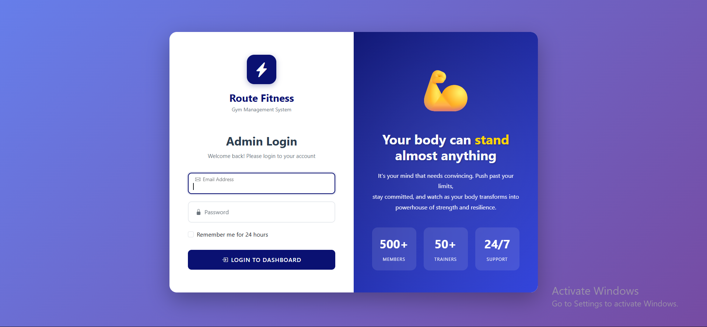
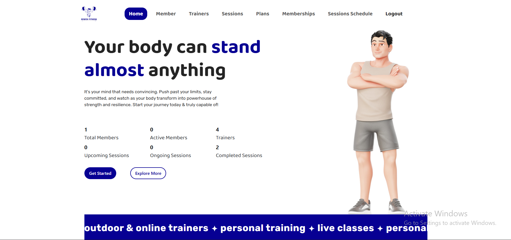
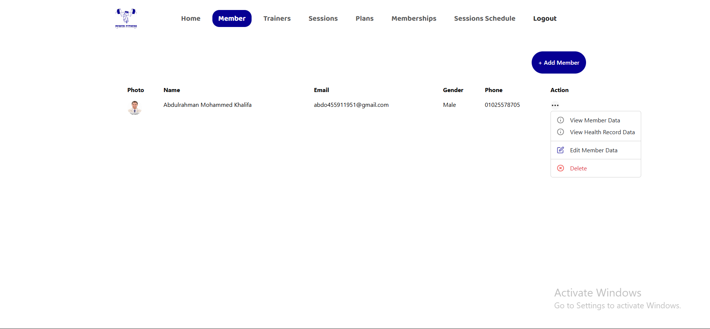
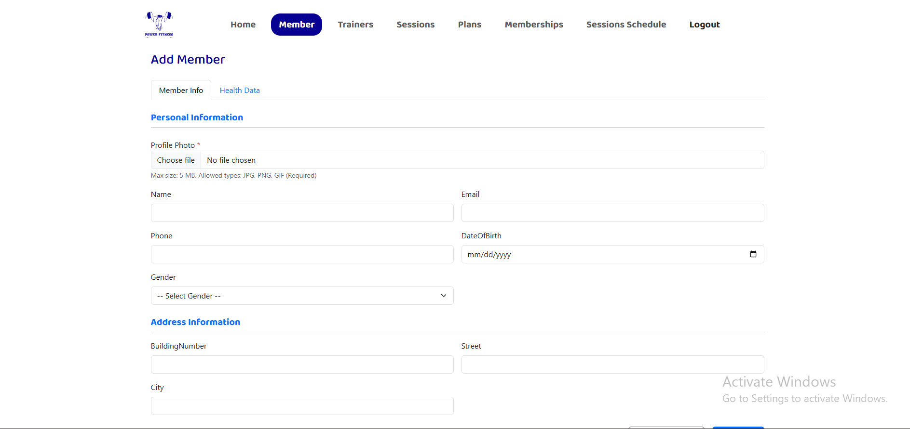
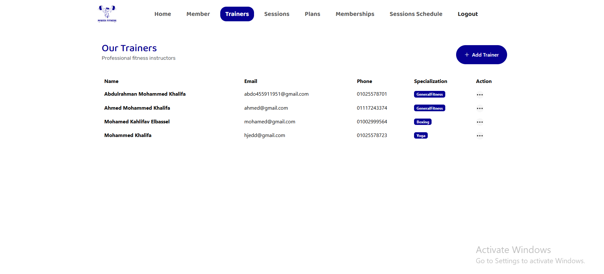
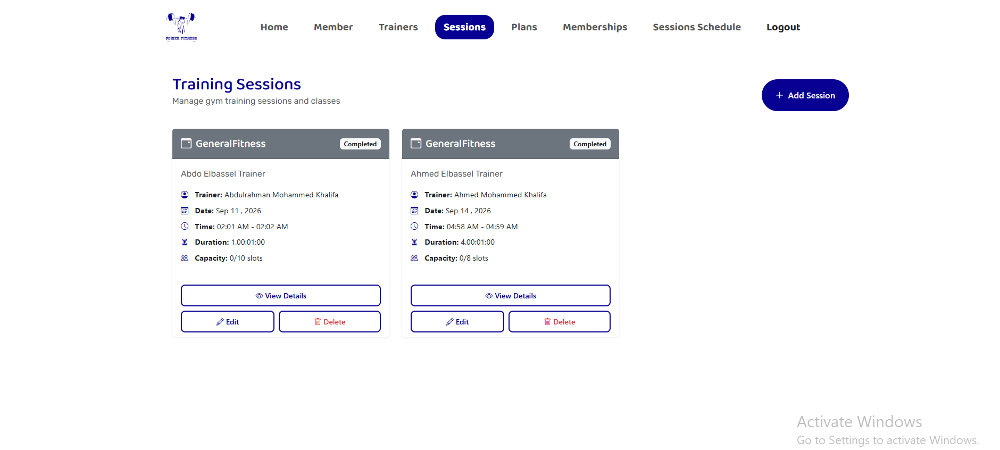
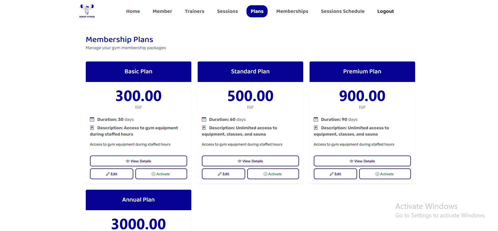
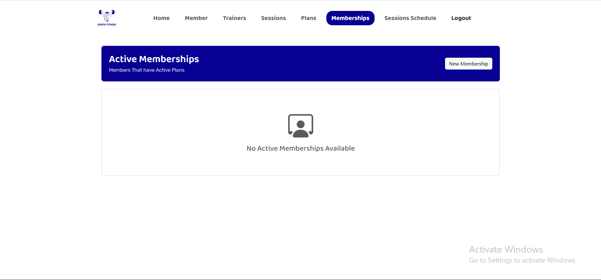
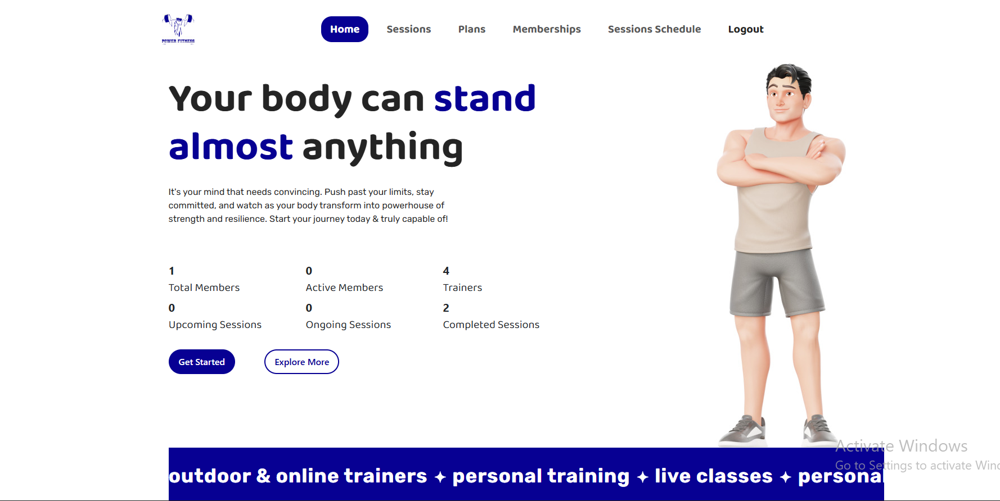

# GymManagementSystem

A gym management web application (**Route Fitness / Power Fitness**) built with **ASP.NET Core MVC**, **Entity Framework Core**, and **SQL Server**. It manages members, trainers, membership plans, memberships, and training sessions, with authentication, role-based access, and a dashboard. The solution follows a three-layer architecture (Presentation, Business Logic, Data Access).

## Features

- **Authentication and role-based authorization** using ASP.NET Core Identity (SuperAdmin and Admin roles)
- **Dashboard:** total and active members, trainers, and upcoming / ongoing / completed sessions
- **Members:** full CRUD, profile photo upload (JPG/PNG/GIF, max 5 MB), address details, and health records
- **Trainers:** full CRUD with specializations (e.g. General Fitness, Boxing, Yoga)
- **Training sessions:** schedule sessions with a trainer, date, time, duration, and capacity; track their status (upcoming, ongoing, completed)
- **Membership plans:** create and edit plans with price, duration, and description; activate or deactivate plans
- **Memberships:** assign plans to members and view active memberships
- **Search and pagination** across list pages
- **Input validation** through view models
- **Database seeding** for initial data and Identity roles/users

## Roles and Access

| Role | Access |
|---|---|
| **SuperAdmin** | Full access: Home, Members, Trainers, Sessions, Plans, Memberships, Sessions Schedule |
| **Admin** | Limited access: Home, Sessions, Plans, Memberships, Sessions Schedule (no Members or Trainers management) |

### Demo accounts

The seeder creates these accounts for local testing:

| Role | Email | Password |
|---|---|---|
| SuperAdmin | `abdoelbassel@gmail.com` | `P@ssw0rd` |
| Admin | `ahmedelbassel@gmail.com` | `P@ssw0rd` |

> These are demo credentials for local development only. Change them before any real deployment.

## Tech Stack

| Area | Technologies |
|---|---|
| Framework | ASP.NET Core MVC, C# |
| Authentication | ASP.NET Core Identity |
| Data access | Entity Framework Core (Code-First, Migrations), LINQ |
| Database | Microsoft SQL Server |
| Patterns | Repository, Unit of Work, Dependency Injection, Service layer, Result pattern, SOLID |

## Architecture

```
GymManagmentSystem (solution)
│
├── GymManagmentSystem.APi        # Presentation layer
│   ├── Controllers               # MVC controllers
│   ├── Views                     # Razor views
│   ├── Extentions                # Service registration / startup extensions
│   ├── MembersPhoto              # Uploaded member photos
│   ├── wwwroot                   # Static files
│   └── Program.cs
│
├── GymManagmentSystem.BLL        # Business logic layer
│   ├── Common                    # Result and ResultKind (operation results)
│   ├── Services                  # Service classes and interfaces (incl. attachments)
│   ├── ViewModels                # Account, Analytics, Booking, Membership,
│   │                             # Member, Plan, Session, Trainer
│   └── MappingMapper.cs          # Entity <-> ViewModel mapping
│
└── GymManagmentSystem.DAL        # Data access layer
    ├── Models                    # Member, Trainer, Plan, Membership, Session,
    │                             # Booking, Category, HealthRecord, ApplicationUser, ...
    ├── Repositories              # Repository classes and interfaces
    ├── Migrations                # EF Core migrations
    ├── DataBaseSeeder.cs
    └── IdentityDataSeed.cs
```

Request flow: `Controller -> Service (BLL) -> Repository / Unit of Work (DAL) -> SQL Server`

## Screenshots

### Login


### Dashboard (SuperAdmin)


### Members


### Add Member


### Trainers


### Training Sessions


### Membership Plans


### Memberships


### Dashboard (Admin role - limited navigation)


## Getting Started

### Prerequisites

- [.NET SDK](https://dotnet.microsoft.com/download)
- SQL Server (LocalDB or a full instance)
- Visual Studio 2022+ (recommended)

### Run locally

1. Clone the repository:
   ```bash
   git clone https://github.com/Abdoelbassel/GymManagementSystem.git
   ```
2. Open the solution in Visual Studio.
3. Set your SQL Server connection string in `appsettings.json` (in the presentation project).
4. Create the database from the migrations. In **Package Manager Console**, set the default project to `GymManagmentSystem.DAL` and run:
   ```powershell
   Update-Database
   ```
5. Set `GymManagmentSystem.APi` as the startup project and press **F5**.
6. Log in with one of the demo accounts above.

The seeders create the initial data and Identity roles when the app starts.

## Author

**Abdulrahman Mohammed Khalifa** - Junior Back-End .NET Developer
[LinkedIn](https://linkedin.com/in/abdulrahman-elbassel) | [GitHub](https://github.com/Abdoelbassel)
